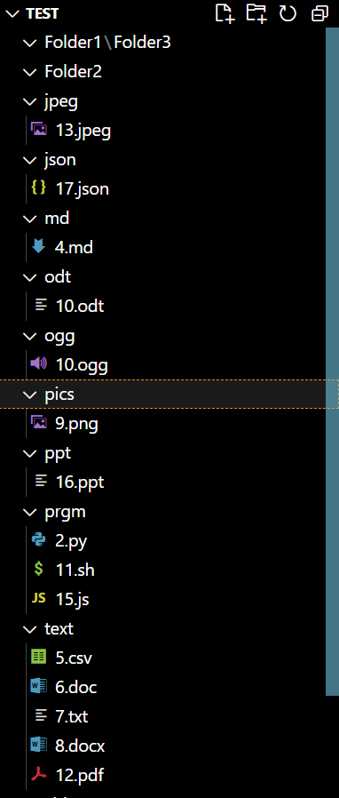
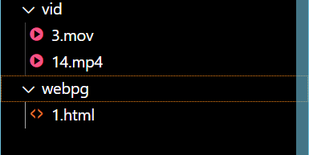

# Directory Sorter

This is a python powered tool which helps sorts directory files containing files of various formats. I have tried to incorporate all the functions based on the instructions and make the interface user-friendly. Any helpful suggestion/edits is welcome.

## Getting started/installation

## Getting Started/Installation

Installation is as easy as cloning the repository and (if you want the tool to work in any directory) adding the same to PATH environment variables

### Cloning

1. To clone, we use CLI

```ps
git clone https://github.com/jhadhriti/Directory-Sorter
```

2. Next, we run the program. All we have to do is copy the path link of your directory file and input it to program. The program shall neatly sort your directory.

```ps
python3 main.py "path/to/the/directory"
```

3. Enjoy your modified and organised directory file!! ( especially for my OCD affected peers)


## Demonstration

1. The inputted directory file:  


2. Command:  

  

3. The sorted directory:  

  



